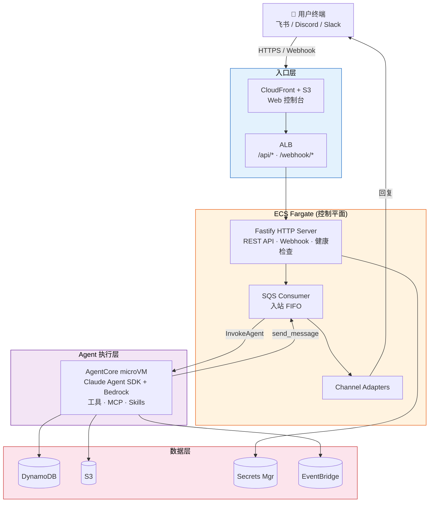

<div align="center">

**[English](./README.md) | [中文](./README.zh-CN.md)**

<!-- Logo / Title -->
<h1>
  
</h1>

<p><strong>基于 AWS 的多租户 NanoClaw 平台</strong></p>

<p>
  <em>创建 Bot · 连接频道 · 在隔离的云环境中运行 Claude Agent</em>
</p>

<!-- Badges -->
<p>
  
  
  
  
  
</p>

<!-- Quick Links -->
<table>
  <tr>
    <td align="center"><a href="./docs/CLOUD_ARCHITECTURE.md"><strong>📐 架构文档</strong></a><br/><sub>完整设计详情</sub></td>
    <td align="center"><a href="#部署"><strong>🚀 部署指南</strong></a><br/><sub>一键部署</sub></td>
    <td align="center"><a href="#本地开发"><strong>💻 本地开发</strong></a><br/><sub>开发环境搭建</sub></td>
    <td align="center"><a href="#消息流转"><strong>📨 消息流转</strong></a><br/><sub>端到端流程</sub></td>
  </tr>
  <tr>
    <td align="center"><a href="#安全架构"><strong>🔒 安全架构</strong></a><br/><sub>认证与隔离</sub></td>
    <td align="center"><a href="#代码包"><strong>📦 代码包</strong></a><br/><sub>Monorepo 结构</sub></td>
    <td align="center"><a href="./docs/TODO.md"><strong>📋 TODO</strong></a><br/><sub>路线图与待办</sub></td>
  </tr>
</table>

<br/>

<details>
<summary><strong>📚 架构深度文档</strong></summary>
<br/>

| 文档 | 主题 |
|------|------|
| [04 — 分层架构](./docs/architecture/04-layered-architecture.md) | 服务分层、频道、Provider |
| [05 — 数据模型](./docs/architecture/05-data-model.md) | DynamoDB 表设计、S3 存储结构 |
| [06–07 — 生命周期](./docs/architecture/06-07-lifecycles.md) | Bot 与 Session 生命周期 |
| [08 — 频道管理](./docs/architecture/08-channel-management.md) | Telegram、Discord、Slack、飞书 |
| [09–10 — Agent 运行时](./docs/architecture/09-10-agent-runtime.md) | AgentCore、Claude SDK、MCP 工具 |
| [11–12 — 安全与可观测性](./docs/architecture/11-12-security-observability.md) | ABAC、WAF、CloudWatch |
| [15 — CDK 部署](./docs/architecture/15-cdk-deployment.md) | 6 个 CDK Stack 基础设施 |
| [16 — System Prompt 构建](./docs/architecture/16-system-prompt-builder.md) | Agent 上下文构建 |

</details>

</div>

<br/>

> 从 [NanoClaw](../README.md)（单用户本地 Bot 框架）演进为完全托管的多租户云平台。每个用户拥有独立的 Bot，具备独立记忆、独立对话和独立定时任务。

---

## 架构

```
用户 (Telegram/Discord/Slack/飞书)
  │
  ▼ Webhook
ALB ──► ECS Fargate (控制平面)
         ├── Webhook 处理 → SQS FIFO
         ├── SQS 消费者 → AgentCore Runtime (microVM)
         │                  └── Claude Agent SDK
         │                      └── Bedrock Claude
         ├── 回复消费者 → 频道 API → 用户
         └── REST API (JWT 认证) ◄── Web 控制台 (React SPA on CloudFront)

数据层: DynamoDB (状态) │ S3 (会话、记忆) │ Secrets Manager (凭证)
调度: EventBridge Scheduler → SQS → Agent
认证: Cognito User Pool (JWT)
安全: WAF │ ABAC via STS SessionTags │ 租户级 S3/DynamoDB 隔离
```

> **部署模式：** 上图为默认的 `agentcore` 模式。`ecs` 模式（用于 AWS 中国区域）下，AgentCore microVM 替换为 ECS Fargate 独占 Task（每个 botId#groupJid 会话一个专属 Task，配合 Warm Pool 实现即时分配），Cognito 替换为自建 OIDC 认证服务，Bedrock 替换为 Anthropic API。详见下方 [ECS 模式](#ecs-模式中国区域)。



## 代码包

| 代码包 | 说明 |
|--------|------|
| `shared/` | TypeScript 类型定义与工具函数（源自 NanoClaw） |
| `infra/` | AWS CDK — 6 个 Stack（Foundation、Auth、Agent、ControlPlane、Frontend、Monitoring） |
| `control-plane/` | Fastify HTTP 服务 + SQS 消费者（运行在 ECS Fargate 上） |
| `agent-runtime/` | Claude Agent SDK 封装（运行在 AgentCore microVM 中） |
| `web-console/` | React SPA — Bot 管理、频道配置、消息历史、定时任务 |
| `auth-service/` | 自建 OIDC 认证服务（JWT + DynamoDB 用户存储，仅 ECS 模式） |

## 核心决策

| 决策项 | 选择 | 原因 |
|--------|------|------|
| 租户模型 | 一用户多 Bot | 按场景隔离 |
| 频道凭证 | BYOK（自带密钥） | 用户完全控制自己的 Bot |
| 控制平面 | ECS Fargate（常驻） | 无 Lambda 15 分钟超时限制 |
| Agent 运行时 | AgentCore (microVM) / ECS Fargate (中国区) | 全球：microVM per-session 隔离 / 中国区：独占 Task per-session + ABAC 隔离 |
| Agent SDK | Claude Agent SDK + Bedrock / Anthropic API | 通过 AGENT_MODE 配置切换 |
| 消息队列 | SQS FIFO | 同 group 有序，跨 group 并行 |
| 数据库 | DynamoDB | Serverless，毫秒级延迟 |
| 认证 | Cognito / 自建 OIDC | 全球使用 Cognito，中国区使用自建 JWT |
| 基础设施 | CDK (TypeScript) | 类型安全，与应用同一语言 |

## NanoClaw → Cloud 映射

| NanoClaw（单用户） | ClawBot Cloud（多租户） |
|--------------------|------------------------|
| SQLite | DynamoDB（7 张表） |
| 本地文件系统 (`groups/`) | S3（会话、CLAUDE.md 记忆） |
| Docker 容器 | AgentCore microVM |
| 文件 IPC | MCP 工具 → AWS SDK (SQS, DynamoDB, EventBridge) |
| 轮询循环 | SQS FIFO 消费者 |
| 频道自注册 | Webhook HTTP 端点 |
| 凭证代理 | IAM Roles + STS ABAC |

## 前置条件

- Node.js >= 20
- Docker（用于构建 ARM64 容器镜像）
- AWS CLI 已配置（`aws configure`）
- AWS CDK 已引导（`cd infra && npx cdk bootstrap`）
- 已安装 `jq`（部署脚本用于 JSON 解析）

## 部署

### 一键部署

```bash
# 完整部署（默认 stage: dev）
ADMIN_EMAIL=admin@example.com ADMIN_PASSWORD=SecurePass123! ./scripts/deploy.sh

# 部署到指定 stage
CDK_STAGE=prod AWS_REGION=us-east-1 ADMIN_EMAIL=admin@company.com ADMIN_PASSWORD=Pr0d!Pass ./scripts/deploy.sh
```

> `ADMIN_EMAIL` 和 `ADMIN_PASSWORD` 为**必填项** — 未设置时脚本将中止。

### ECS 模式（中国区域）

用于 AWS 中国区域（cn-north-1、cn-northwest-1）部署，这些区域不支持 Cognito、Bedrock 和 AgentCore：

```bash
# ECS 模式部署
DEPLOY_MODE=ecs ADMIN_EMAIL=admin@example.com ADMIN_PASSWORD=SecurePass123! ./scripts/deploy.sh

# ECS 模式使用：
# - 自建 OIDC 认证服务（替代 Cognito）
# - ECS Fargate 独占 Task per-session（替代 AgentCore microVM）
#   每个 botId#groupJid 获得专属 Fargate Task，配合 Warm Pool 实现即时分配
# - Anthropic API（替代 Bedrock）— 需要用户自备 API Key
```

| 变量 | 必填 | 默认值 | 说明 |
|------|------|--------|------|
| `DEPLOY_MODE` | 否 | `agentcore` | 部署模式：`agentcore`（默认）或 `ecs`（中国区域） |
| `ADMIN_EMAIL` | 是 | — | 初始管理员账户邮箱 |
| `ADMIN_PASSWORD` | 是 | — | 初始管理员账户密码 |
| `CDK_STAGE` | 否 | `dev` | 部署阶段名称 |
| `AWS_REGION` | 否 | `us-west-2` | 目标 AWS 区域（中国区使用 `cn-northwest-1` 或 `cn-north-1`） |

#### ECS 模式参数（CDK context）

以下参数通过 CDK context 传递，控制 ECS 独占 Task 模型的行为：

| 参数 | 默认值 | 说明 |
|------|--------|------|
| `minWarmTasks` | `2` | Warm Pool 中保持的预启动空闲 Fargate Task 数量，用于即时分配 |
| `maxTasks` | `500` | 集群中最大 ECS Agent Task 总数 |
| `idleTimeoutMinutes` | `15` | 无活动多少分钟后，独占 Task 自动停止 |

Warm Pool 消除了新 Session 的冷启动延迟（~30-90 秒）。当新 Session 的消息到达时，控制平面从 Warm Pool 中即时领取一个预热 Task 并在后台补充。如果 Pool 为空，则回退到冷启动方式启动新 Task。每个 Session（botId#groupJid）获得专属的 Fargate Task；Task 在空闲超时后自动停止。

`DEPLOY_MODE=ecs` 标志会：
- 额外构建并推送 auth-service Docker 镜像
- 向 CDK 传递 `--context mode=ecs`（创建 auth ECS 服务 + agent ECS 基础设施，替代 Cognito + AgentCore）
- 跳过 AgentCore 注册步骤（8、9、9b、10、11）
- 将 web-console 配置为 OIDC 认证（替代 Cognito）
- 直接在 DynamoDB 中创建管理员（通过 Node.js 生成 bcrypt 哈希）

部署脚本按顺序执行 17 个步骤：
1. 前置检查（aws、docker、node、jq）
2. `npm install` + 构建所有工作区
3. ECR 登录（如缺少则创建仓库）
4. 构建并推送 control-plane Docker 镜像（ARM64）
5. 构建并推送 agent-runtime Docker 镜像（ARM64）
6. CDK 部署全部 6 个 Stack
7. 读取 Stack 输出（Cognito ID、S3 桶名、角色 ARN、ALB DNS、CDN 域名）
8. 注册 AgentCore Runtime（幂等 — 已存在则跳过）
9. 等待 AgentCore 状态变为 READY
10. 更新 ECS Task Definition 添加 `AGENTCORE_RUNTIME_ARN` 环境变量
11. 强制 ECS 滚动部署
12. 使用 Cognito 配置构建 web-console（通过环境变量注入）
13. 将 `web-console/dist/` 同步到 S3 前端桶
14. CloudFront 缓存失效
15. 冒烟测试（`/health` 端点）
16. 创建默认管理员账户（幂等 — 已存在则跳过）
17. 将 AgentCore Runtime ARN 写入 SSM Parameter Store

> ECS 模式下步骤 5b、8-11、16-17 行为不同。详见上方 `DEPLOY_MODE=ecs` 说明。

> **管理员账户：** 由于 Cognito 禁用了自助注册，步骤 16 创建初始管理员用户。`ADMIN_EMAIL` 和 `ADMIN_PASSWORD` 为必填环境变量 — 未设置时脚本不会启动。

### 销毁

```bash
./scripts/destroy.sh                    # 默认 stage: dev
CDK_STAGE=prod ./scripts/destroy.sh     # 指定 stage
```

按逆序执行：删除 AgentCore Runtime（等待删除完成）→ CDK 销毁所有 Stack → 删除 ECR 仓库。

### 本地开发

```bash
# 本地运行控制平面（指向已部署的 AWS 资源）
cd control-plane
cp .env.example .env   # 填入 CDK 输出的值
npm run dev

# 本地运行 Web 控制台
cd web-console
npm run dev            # 打开 http://localhost:5173
```

## 项目结构

```
cloud_native_nanoclaw/
├── scripts/
│   ├── deploy.sh             # 一键完整部署（17 步）
│   └── destroy.sh            # 逆序销毁
├── shared/src/
│   ├── types.ts              # User, Bot, Channel, Message, Task, Session...
│   ├── xml-formatter.ts      # Agent 上下文格式化（源自 NanoClaw）
│   └── text-utils.ts         # 输出处理
├── auth-service/src/
│   ├── server.ts             # Fastify 认证服务（登录、刷新、管理）
│   ├── jwt.ts                # RS256 签名、JWKS 端点
│   └── password.ts           # bcrypt 密码哈希
├── infra/
│   ├── bin/app.ts            # CDK 应用入口
│   └── lib/
│       ├── foundation-stack.ts   # VPC、S3、DynamoDB、SQS、ECR
│       ├── auth-stack.ts         # Cognito
│       ├── agent-stack.ts        # IAM Roles (ABAC)
│       ├── control-plane-stack.ts# ALB、ECS Fargate、WAF
│       ├── frontend-stack.ts     # CloudFront + S3
│       └── monitoring-stack.ts   # CloudWatch、告警
├── control-plane/src/
│   ├── index.ts              # Fastify 应用 + SQS 消费者启动
│   ├── webhooks/             # Telegram、Discord、Slack 处理器
│   ├── sqs/                  # 消息分发器 + 回复消费者
│   ├── routes/api/           # REST API（bots、channels、groups、tasks）
│   ├── services/             # DynamoDB、缓存、凭证查询
│   └── channels/             # 频道 API 客户端
├── agent-runtime/src/
│   ├── server.ts             # HTTP 服务（/invocations、/ping）
│   ├── agent.ts              # Claude Agent SDK 集成
│   ├── session.ts            # S3 会话同步
│   ├── memory.ts             # 多层 CLAUDE.md 记忆
│   ├── scoped-credentials.ts # STS ABAC 凭证
│   ├── mcp-tools.ts          # send_message、schedule_task 等
│   └── mcp-server.ts         # MCP stdio 服务
└── web-console/src/
    ├── pages/                # Login、Dashboard、BotDetail、ChannelSetup...
    ├── lib/                  # Auth (Cognito)、API 客户端
    └── components/           # 布局组件
```

## 消息流转

1. 用户在 Telegram 群组中发送 `@Bot 你好`
2. Telegram POST → `/webhook/telegram/{bot_id}`（ALB → Fargate）
3. Webhook 处理器验证签名，将消息存入 DynamoDB，入队 SQS FIFO
4. SQS 消费者出队，加载近期消息，异步调用 AgentCore Runtime（fire-and-forget）
5. AgentCore 立即返回 `accepted`，Agent 在后台运行 → Claude Agent SDK `query()`
6. Agent 生成回复，可选使用 MCP 工具（schedule_task、send_message）
7. 最终回复通过 SQS 回复队列 → 回复消费者存入 DynamoDB，通过 Telegram API 发送
8. 用户在 Telegram 中看到回复

## 安全架构

- **认证**：所有 `/api/*` 路由使用 Cognito JWT（agentcore 模式）或自建 JWKS JWT（ecs 模式）
- **Webhook**：每个频道独立的签名验证（Telegram secret token、Discord Ed25519、Slack HMAC-SHA256）
- **数据隔离**：ABAC via STS SessionTags — Agent 只能访问其所有者的 S3 路径和 DynamoDB 记录
- **网络**：Fargate 运行在私有子网中，WAF 速率限制（2000 请求/5分钟/IP）
- **凭证**：频道 Token 存储在 Secrets Manager 中，永不暴露给 Agent

## 成本估算（单用户）

| 组件 | 月成本（约） |
|------|------------|
| AgentCore（30 条消息/天，平均 18 秒） | $0.40 |
| Bedrock Claude Token | $5.40 |
| Fargate（2 个 Task，0.5 vCPU） | $30 |
| ALB | $16 |
| DynamoDB（按需模式） | $0.50 |
| S3 + CloudFront | $0.60 |
| **总计（1 用户）** | **~$53/月** |
| **100 用户（分摊后）** | **~$8/用户/月** |

## 文档

| 资源 | 说明 |
|------|------|
| [📊 架构 PPT](./docs/nanoclaw-architecture.pptx) | 可视化系统概览演示文稿 |
| [📐 云架构设计](./docs/CLOUD_ARCHITECTURE.md) | 完整设计文档及所有细节 |
| [📋 TODO 与路线图](./docs/TODO.md) | 待办事项、延期项目、未来工作 |
